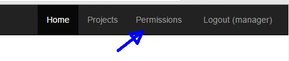

##Documentation##

Blah blah blah. 

    SET greeting = hello world
    # indented 4 spaces


----------

Here's our logo (hover to see the title text):

Inline-style: 


Reference-style: 
![alt text][logo]

[logo]: https://github.com/adam-p/markdown-here/raw/master/src/common/images/icon48.png "Logo Title Text 2



----------
```javascript
var s = "JavaScript syntax highlighting";
alert(s);
```
 
```python
s = "Python syntax highlighting"
print s
```
 
```
No language indicated, so no syntax highlighting. 
But let's throw in a <b>tag</b>.
```


> Blockquotes are very handy in email to emulate reply text.
> This line is part of the same quote.

Quote break.

> This is a very long line that will still be quoted properly when it wraps. Oh boy let's keep writing to make sure this is long enough to actually wrap for everyone. Oh, you can *put* **Markdown** into a blockquote.


<dl>
  <dt>Definition list</dt>
  <dd>Is something people use sometimes.</dd>

  <dt>Markdown in HTML</dt>
  <dd>Does *not* work **very** well. Use HTML <em>tags</em>.</dd>
</dl>

---
embed

<a href="http://www.youtube.com/watch?feature=player_embedded&v=vmwnhZmEZjc
" target="_blank"></a>

link

[](http://www.youtube.com/watch?v=vmwnhZmEZjc)
